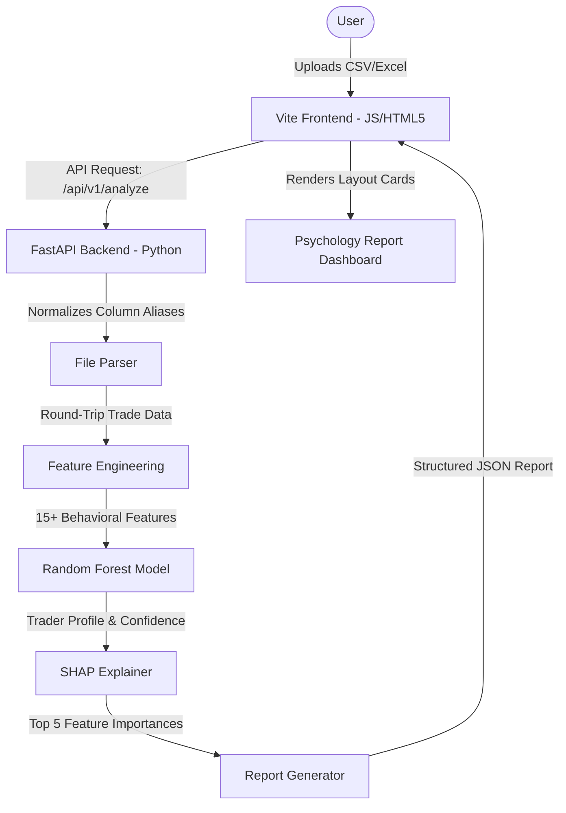

# TradePsych AI — Project Summary & Workflow

This document provides a comprehensive summary of the **AI-Based Trading Psychology & Behavior Analysis System** (TradePsych AI) and details the step-by-step workflow of the application from file upload to psychological profile generation.

---

## 1. Project Overview & Summary

**TradePsych AI** is an advanced analytics platform designed to decode the hidden cognitive biases and emotional patterns influencing a trader's financial performance. Unlike traditional analytical tools that focus purely on returns, this system analyzes *behaviors*—such as revenge trading, panic selling, FOMO (Fear of Missing Out), and overconfidence—using machine learning.

### Key Capabilities:
* **Dynamic Trade Classification:** Analyzes trade sequences to classify behaviors (e.g., detecting revenge trades placed immediately following a loss, or premature exits caused by anxiety).
* **Machine Learning Classifier:** Runs a pre-trained **Random Forest** model on engineered behavioral features to categorize the trader into distinct psychological profiles.
* **Explainable AI (SHAP):** Computes **SHAP (SHapley Additive exPlanations)** values to identify and display the top 5 behavioral drivers influencing the trader's profile.
* **Actionable Psychology Reports:** Generates tailored recommendations, risk projections, and psychological advice based on the identified profile.

---

## 2. System Architecture

The project is structured as a decoupled full-stack application:



### Technology Stack:
1. **Frontend (SPA):** Built using **Vite**, vanilla ES Modules, and HTML5.
   - Styling: Vanilla CSS with custom design tokens (`index.css`), glassmorphism, responsive grids, and clean layout animations.
   - Core Pages: Welcome page, login/signup flows, user dashboard, and the psychology report.
2. **Backend (API):** Powered by **FastAPI** (running on Uvicorn).
   - Core Packages: `pandas`, `numpy`, `scikit-learn` (for prediction), `joblib` (model loading), and `shap` (explainability).

---

## 3. The Core Machine Learning & Behavioral Engine

### A. Trader Personality Profiles
The Random Forest model classifies traders into one of five distinct behavioral types:
1. **Emotional Trader:** Driven by emotional reactions, showing high variability in sizing and short recovery times after losses.
2. **Impulsive Trader:** Overtrades frequently, acts quickly without planning, and experiences high trading frequency.
3. **Overconfident Trader:** Scales up position sizes aggressively during winning streaks, exposing themselves to catastrophic drawdowns.
4. **Risk-Averse Trader:** Cuts winning trades short due to premature anxiety while letting losing trades linger out of hope.
5. **Disciplined Trader:** Standardized position sizes, measured entry-delays, and systematic rule adherence.

### B. Engineered Behavioral Features
The feature engineering script (`generate_features.py`) translates raw trading logs into behavioral metrics:
* `win_rate`: Ratio of profitable trades to total trades.
* `profit_factor`: Gross gains divided by gross losses.
* `post_loss_position_change`: Percentage change in position sizing immediately following a losing trade (reveals revenge sizing).
* `post_loss_trade_delay`: Time elapsed between exiting a losing trade and entering the next trade (reveals emotional retaliation).
* `position_size_variance`: Volatility of sizes, measuring discipline consistency.
* `risk_escalation_ratio`: Sizing metrics in the second half of trading history vs. the first half.

---

## 4. End-to-End Application Workflow

Here is the step-by-step lifecycle of how a user's trading statement is processed:

### Step 1: Upload & Schema Normalization (Frontend)
1. The user uploads a CSV, XLSX, or XLS statement in the drag-and-drop zone.
2. The frontend parser (`fileParser.js`) reads the sheet and runs a **Dynamic Header Scanner** to locate the exact starting row of the table. It scans for safe columns like `symbol`, `scrip`, or `ticker` to automatically skip empty metadata lines or report titles.
3. The parser maps columns flexibly using alias lists (e.g., mapping `"Scrip Name"`, `"Instrument"`, or `"Symbol"` to `'symbol'`) and strips spaces/underscores.
4. It performs validation to ensure minimum columns (symbol, quantity, price) exist, then enables the **Analyze** button.

### Step 2: REST Request transmission
1. The raw file is sent as a multipart upload to the FastAPI backend endpoint: `POST /api/v1/analyze`.

### Step 3: Feature Engineering & Clean up (Backend)
1. The backend parses the raw file bytes, locates the header row using Python `pandas`, and normalizes column headers.
2. The dataset is split into individual round-trip BUY/SELL trade records (`services/file_parser.py`).
3. The clean trade records are fed to the feature generator, which computes the 15+ complex behavioral features, replacing infinity/NaN values with clean float baselines.

### Step 4: ML Profile Inference
1. The backend loads the pre-trained classifier `random_forest.pkl`.
2. The model predicts the trader's profile classification and calculates a percentage confidence score.

### Step 5: SHAP Feature Importance Attribution
1. The backend passes the model and features through a **SHAP TreeExplainer**.
2. It extracts the SHAP values corresponding to the predicted trader class.
3. It ranks the features by mathematical importance and formats the top 5 drivers with descriptive display names, thresholds, and educational descriptions.

### Step 6: Detailed Rule-Based Analytics & Recommendations
1. The `TradingAnalyzer` processes win rates, average win/loss values, and loss causes.
2. Tailored actionable recommendations are assembled into warnings, danger signs, or tips based on the identified emotional profile.
3. A JSON payload containing all profile data, feature importances, win rates, and advice is returned to the frontend.

### Step 7: Dynamic Report Rendering (Frontend SPA)
1. The frontend stores the report data in `sessionStorage` and navigates to the `#/report` route.
2. The report page (`report.js`) renders the grid cards with staggered animation entries:
   * **Card 1: Profile Accuracy:** Renders a circular SVG confidence ring mapping the AI accuracy.
   * **Card 2: Trader Personality:** Displays the profile name, badge, matching emoji, and a comprehensive explanation.
   * **Card 3: Behavioral Drivers:** Generates horizontal progress bars showing the top 5 SHAP values.
   * **Card 4: Actionable Advice:** Generates styled bullet advice cards.
   * **Card 5: Future Risks & Recommendations:** Renders a clean list of danger thresholds and preventative actions.
   * **Card 6: AI Future Projections:** Displays customized text outlining performance predictions for the next 30 sessions.

---

## 5. How to Run the Project Locally

### 1. Backend Server (FastAPI)
Navigate to the root directory and start the Python environment, then launch the FastAPI server:
```bash
# Verify packages are installed
pip install -r requirements.txt

# Start backend
uvicorn main:app --reload --port 8000
```
*Runs on:* `http://localhost:8000`

### 2. Frontend Server (Vite)
Navigate to the root directory and start the node development server:
```bash
# Verify packages are installed
npm install

# Start frontend dev server
npm run dev
```
*Runs on:* `http://localhost:5173`
